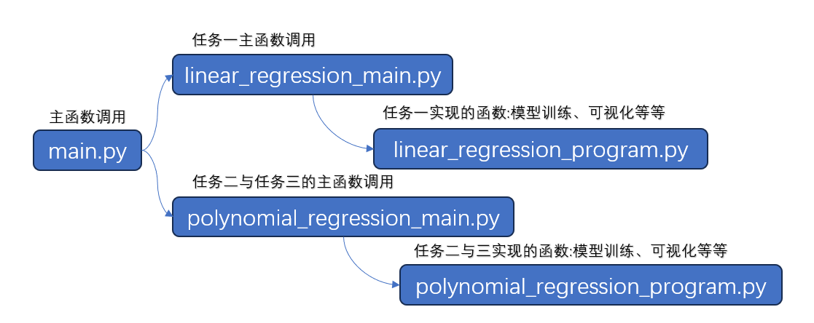

# 多项式回归与正则化
回归分析(regression analysis)是通过大量实验或观测数据，用统计的方法寻找变量之间的关系和统计规律的一种研究方法。本次的实验内容主要有以下三个任务：

(1) 完成MiniBatch梯度下降方法的代码，得到参数路径θ，并且在1.2.4小节中进行路径对比，思考1.2.4中的问题，如何选择batch的数量。

(2) 完成2.1小节中度数为1，2，100的设置，绘图观察结果并加以分析。

(3) 分析2.3小节，从训练误差、验证误差、误差差异角度分析图，并总结过拟合的标志。

## 实验环境

操作系统：Windows 11 Version 23H2

Python版本：Python 3.11.4 ('base':conda)

## 文件介绍



其中：
- [main.py](main.py) 本次任务的主函数，会在函数中调用三个任务对应的代码。

- [linear_regression_main.py](linear_regression_main.py) 任务一的主函数，调用了最小二乘法、普通梯度下降法、批梯度下降法、小批量梯度下降法、以及随机梯度下降法的函数，最后进行了梯度下降法之间的比较。

- [linear_regression_program.py](linear_regression_program.py) 包含了任务一的函数，实现了最小二乘法、普通梯度下降法、批梯度下降法、小批量梯度下降法、以及随机梯度下降法，会被 linear_regression_main.py 调用。

- [polynomial_regression_main.py](polynomial_regression_main.py) 任务二和三的主函数，调用了对数据进行多项式拟合、以及数据可视化的函数，最后进行了作图比较。

- [polynomial_regression_program.py](polynomial_regression_program.py) 包含了任务一的函数，实现了对数据进行多项式拟合、以及数据可视化的函数，会被 polynomial_regression_main.py 调用。

## 运行

执行所有任务
```shell
python main.py
```

执行任务一
```shell
python linear_regression_main.py
```

执行任务二
```shell
python polynomial_regression_main.py
```


